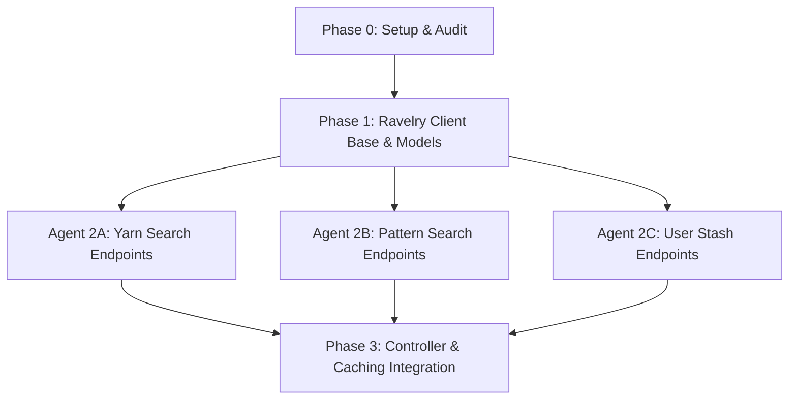

# Multi-Agent Delegation & Orchestration Strategy

Track: `ravelry_client_20260712`

To ensure efficiency and maintain code quality, we will leverage parallel subagent execution. Work will be isolated inside the git worktree `feat/ravelry-client-20260712`.

## 1. Context Isolation & Agent Roles
- **Supervisor (Main Thread)**: Coordinates the track, writes tests, reviews PRs/diffs using `cavecrew-reviewer`, handles final alignment, integration, and commits.
- **Worker 1 (Client Foundation)**: Builds `stashies/ravelry_client.py` and core dataclasses.
- **Worker 2 (Yarn Endpoints)**: Implements yarn search/retrieve endpoints.
- **Worker 3 (Pattern Endpoints)**: Implements pattern search/retrieve endpoints.
- **Worker 4 (Stash Endpoints)**: Implements stash management and update endpoints.

## 2. Execution Phases & Parallel Pipeline

### Phase 1: Client Base & Dataclasses
- **Implementation**: Done by **Worker 1** (specialized python subagent).
- **Verification**: Local pytest suite targeting initialization and Pydantic validation.

### Phase 2: Parallel Endpoint Implementation (Coordinated Swarm)
- Once Phase 1 is merged, we spawn **three concurrent subagents** to implement core API wrappers:
  1. **Yarn Endpoint Subagent**: Target `stashies/ravelry_client.py` yarn methods.
  2. **Pattern Endpoint Subagent**: Target `stashies/ravelry_client.py` pattern methods.
  3. **Stash Endpoint Subagent**: Target `stashies/ravelry_client.py` stash management methods.
- **Rules**:
  - Each agent works on a separate class method, avoiding merge conflicts.
  - Subagents run unit tests for their specific endpoint.
  - Upon completion, supervisor reviews changes with `cavecrew-reviewer` and merges.

### Phase 3: Integration & Sync
- Supervisor performs integration with `AppController` and cache layers.

## 3. Merge & Quality Gates
- **Gate 1**: Unit test coverage for new endpoints must be >80% (Red-Green-Refactor).
- **Gate 2**: Diff review by `cavecrew-reviewer` for docstring compliance (Strict Pythonic).
